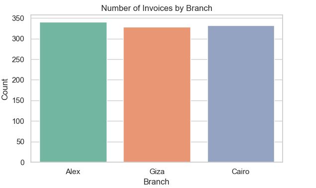
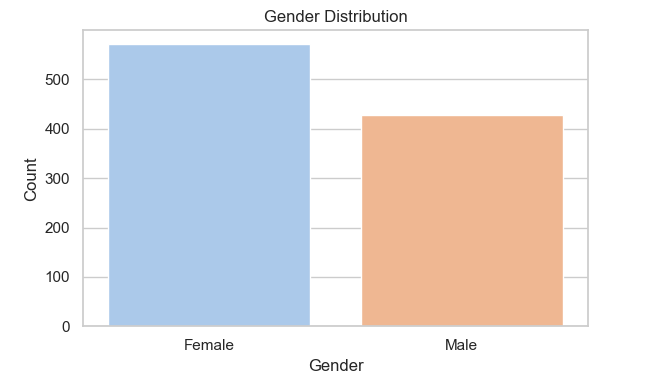
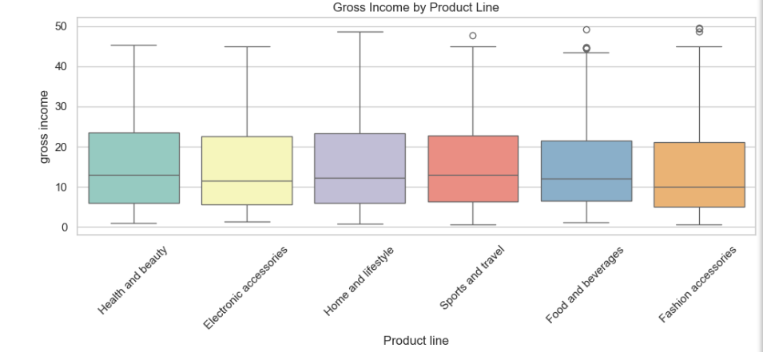
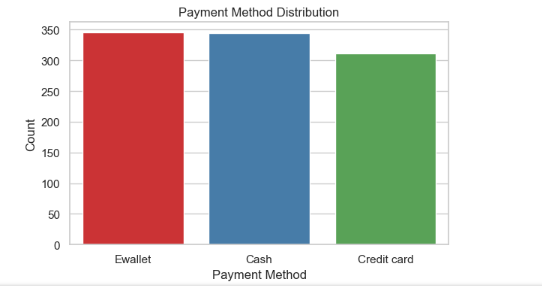
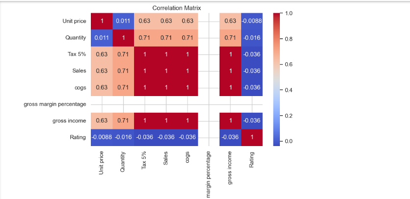

# 🛒 Supermarket Sales EDA

This project performs **Exploratory Data Analysis (EDA)** on the **Supermarket Sales Dataset**. The goal is to extract insights from sales data across different product lines, branches, and customer segments.

---

## 📂 Project Files

- `supermarket_sales.csv` - Dataset
- `supermarket_sales_eda.ipynb` - EDA notebook
- `.png` files - Data visualization outputs

---

## 📈 Key Visualizations

### 🏪 Invoice Count by Branch
Shows number of invoices generated by each branch.

---

### 👨‍👩‍👧 Gender Distribution
Represents the distribution of customers by gender.

---

### 📦 Gross Income by Product Line
Highlights which product lines generate the highest gross income.

---

### 💳 Payment Method Distribution
Displays preferred payment methods across all transactions.

---

### 🔍 Correlation Matrix
Shows the correlation between numerical variables in the dataset.

---

## 🧪 Tools Used

- Python
- Pandas
- Matplotlib
- Seaborn
- Jupyter Notebook

---

## 📌 Dataset Source

[Supermarket Sales Dataset on Kaggle](https://www.kaggle.com/datasets/aungpyaeap/supermarket-sales)

---

## 🔍 Key Insights

- **Branch C** had the highest invoice count.
- **Female** customers slightly outnumbered **males**.
- **Food and beverages** generated the highest gross income.
- **E-wallets** were the most used payment method.
- Positive correlation found between gross income and total sales.

---

## 👨‍💻 Author

**Sahil Gore**  
GitHub: [@SahilGore-bit](https://github.com/SahilGore-bit)

---

## 📄 License

This project is licensed for educational purposes only.